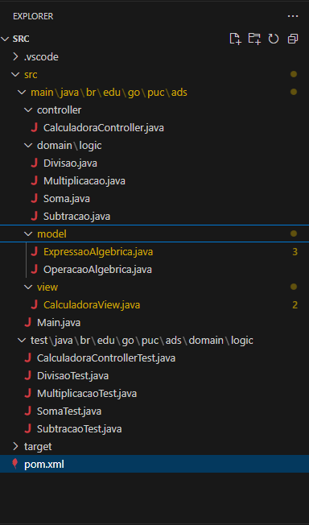
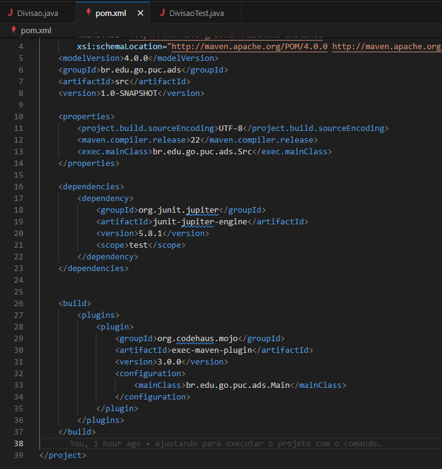
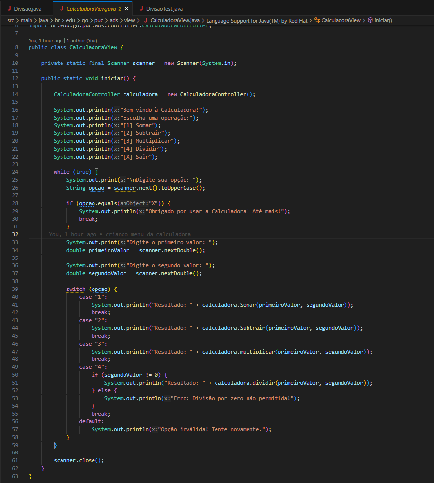
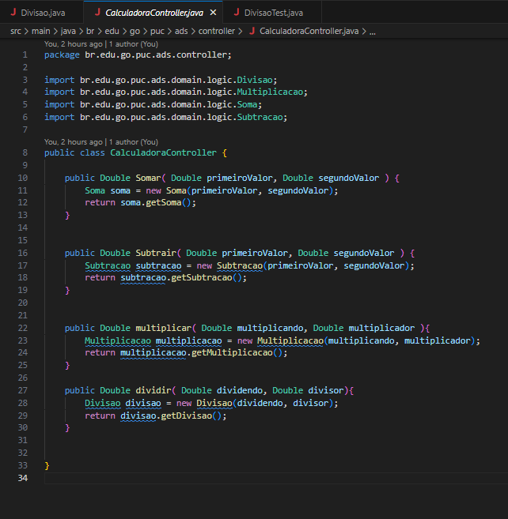
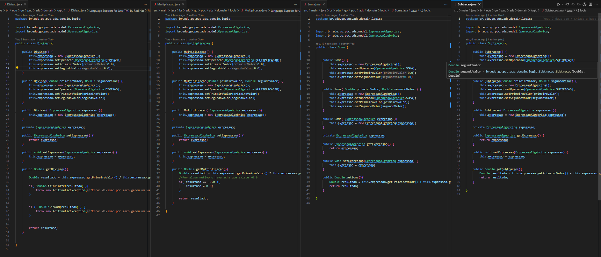
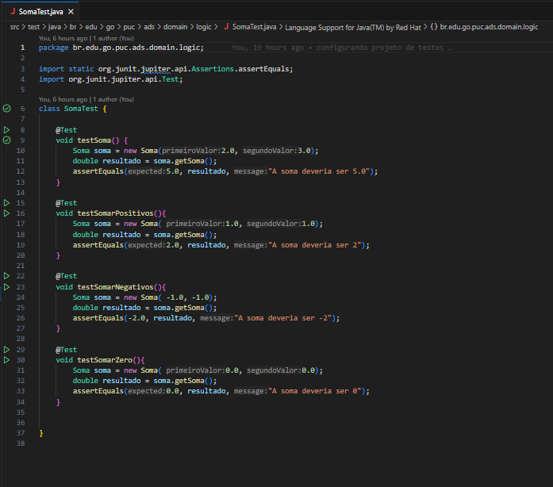
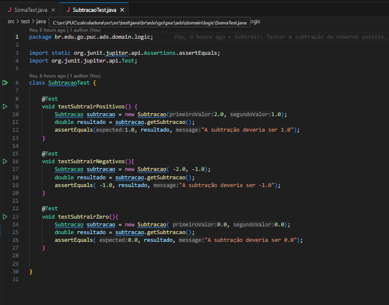
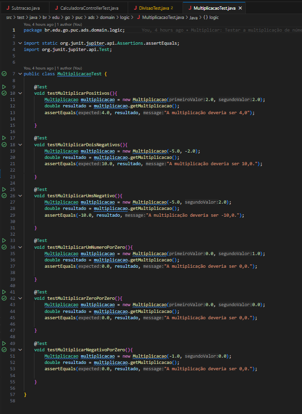
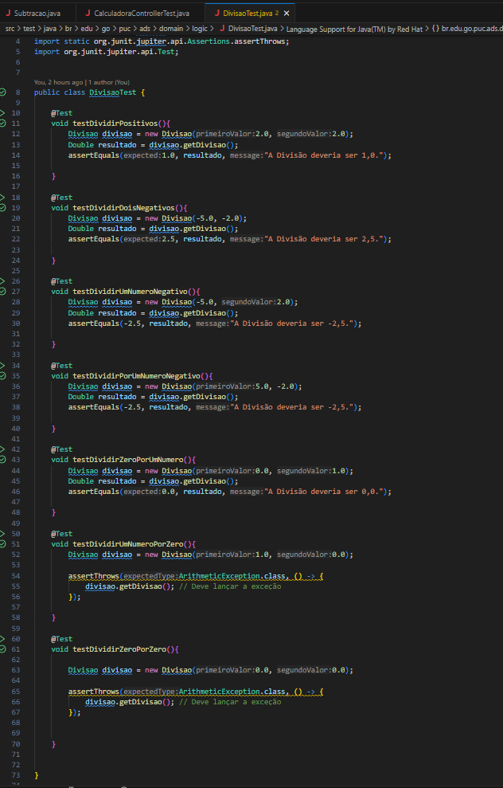
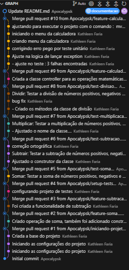

# calculadora
*Este projeto visa testar conceitos básicos de desenvolvimento de software, versionamento de código e testes de software(unitários e funcionais).*


## Como esse projeto foi construído :

- Java
- Maven
- Junit 5
- Arquitetura MVC

## Comandos do projeto 
-  Para executar a aplicação : ```mvn clean compile exec:java```
-  Para Executar os testes : ``` mvn clean test```
-  Para fazer build do projeto : ```mvn clean install```

## Exemplo de execução :
```
Bem-vindo à Calculadora!
Escolha uma operação:
[1] Somar
[2] Subtrair
[3] Multiplicar
[4] Dividir
[X] Sair

Digite sua opção: 1
Digite o primeiro valor: 1
Digite o segundo valor: 2
Resultado: 3.0

Digite sua opção: 0
Digite o primeiro valor: 0
Digite o segundo valor: 0
Opção inválida! Tente novamente.

Digite sua opção: 4
Digite o primeiro valor: 0
Digite o segundo valor: 0
Erro: Divisão por zero não permitida!

Digite sua opção: x
Obrigado por usar a Calculadora! Até mais!
```

## Detalhes do projeto


- Essa é a estrutura básica do projeto, onde o pacote doamin\logic contem classes que 
devem interagir com as operações. Foi feito dessa forma para poder desacoplar o projeto.



- O Projeto maven é simples, contem apenas as configurações do projeto, as dependências do 
Junit 5 e as configurações para executar o projeto na linha de comando.



- O Projeto é simples, contem uma classe que representa o menu da aplicação :



- Que por sua vez chama uma classe que controla as operações, agrupando em funcionalidades :



- E finalmente essa classe controladora depende das suas 4 operações e os objetos que representa uma operação simples :



- O projeto conta com testes também, testes unitários simples e testes das funcionalidades :

    - Soma :
    
    

    - Subtração :

    
    
    - Multiplicação :

    

    - Divisão :

    

## As branch's do projeto

- Mostrando a evolução do projeto até aqui :



